# Workshop Diagrams and Flows

This document provides practical flow diagrams for live workshop delivery.

## Diagram Placement Map (Exact Workshop Pages)

Use this matrix to place each flow in the matching workshop page.

| Workshop page | Recommended diagram | Placement inside page |
|---|---|---|
| `/workshop/setup` | `1. End-to-End Workshop Flow` | After page lead, before first setup command |
| `/workshop/copilot-intro` | `3. Copilot Test Workflow` | After model/mode explanation, before slash commands |
| `/workshop/copilot-overview` | `2. Delivery Rhythm per Step` | After trust model section |
| `/workshop/unit-testing` | `4. Unit Testing Flow (Step 4)` | Before prompt-first or generation section |
| `/workshop/api-integration` | `5. API and Integration Testing Flow (Step 5)` | Before scaffold generation prompt |
| `/workshop/test-data-mocks` | `6. Test Data and Mocks Flow (Step 6)` | Before fixture factory section |
| `/workshop/reviewing-tests` | `7. Review and Guardrails Flow (Step 7)` | Before review checklist table |
| `/workshop/cicd-adoption` | `8. CI/CD Adoption Flow (Step 8)` | Before GitHub Actions workflow section |
| `/workshop/e2e-playwright` | `9. E2E Playwright Flow (Step 9)` | Before page object model section |
| `/workshop/component-testing` | `10. Component Testing Flow (Step 10)` | Before RTL philosophy section |
| `/workshop/ai-testing-patterns` | `11. AI Testing Patterns Flow (Step 11)` | Before non-deterministic output section |
| `/workshop/takeaways` | `12. Facilitator Flow for 120 Minutes` + `13. Audience Branching Flow` | Before resources/what-next section |

## Delivery Notes

- Keep one primary diagram visible per step page to avoid cognitive overload.
- For conference delivery, use the facilitator timer and jump links to align with `2. Delivery Rhythm per Step`.
- Use `1. End-to-End Workshop Flow` on opening and transition moments, not on every page.

## 1. End-to-End Workshop Flow

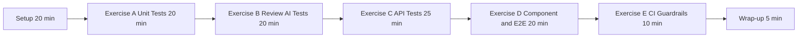

## 2. Delivery Rhythm per Step

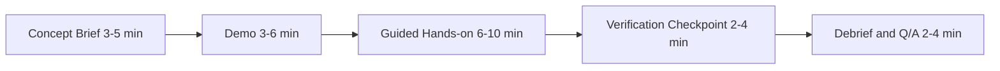

## 3. Copilot Test Workflow

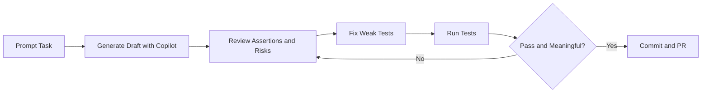

## 4. Unit Testing Flow (Step 4)

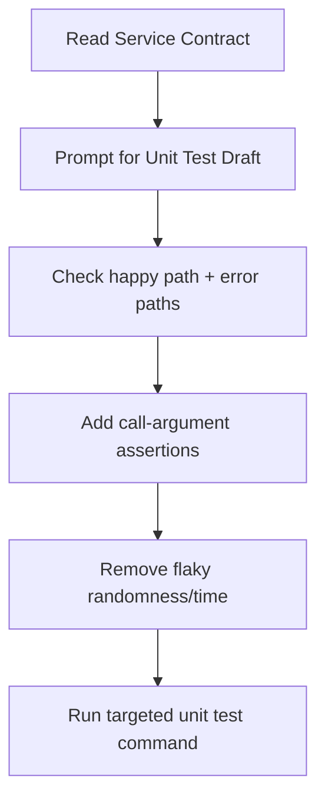

## 5. API and Integration Testing Flow (Step 5)

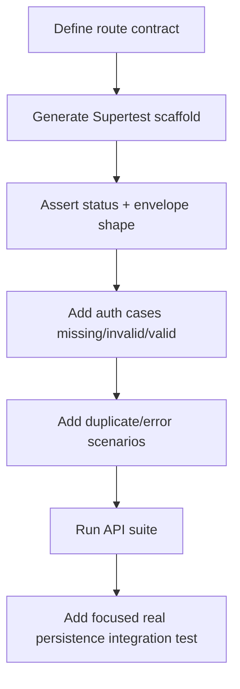

## 6. Test Data and Mocks Flow (Step 6)

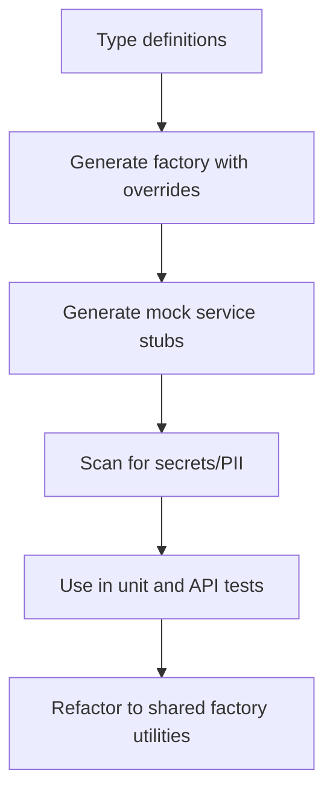

## 7. Review and Guardrails Flow (Step 7)

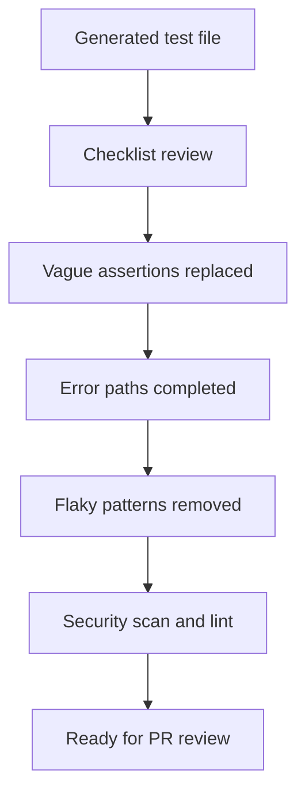

## 8. CI/CD Adoption Flow (Step 8)

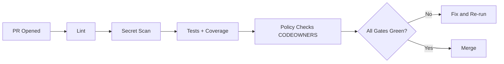

## 9. E2E Playwright Flow (Step 9)

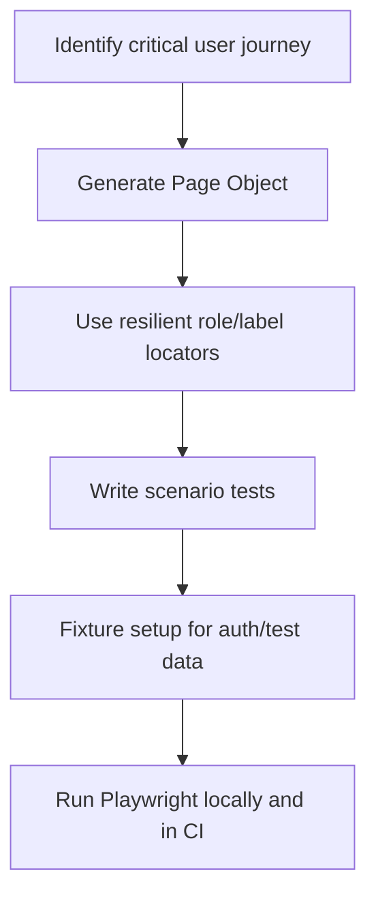

## 10. Component Testing Flow (Step 10)

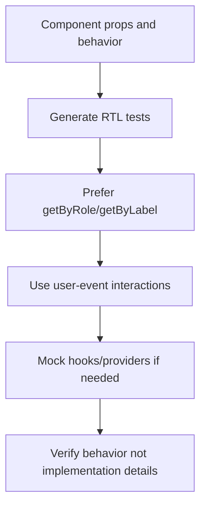

## 11. AI Testing Patterns Flow (Step 11)

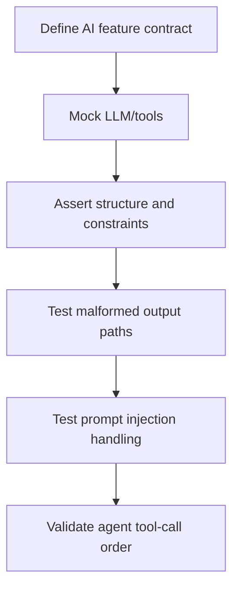

## 12. Facilitator Flow for 120 Minutes

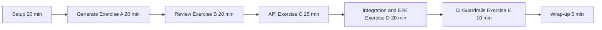

## 13. Audience Branching Flow (Conference Mixed Audience)

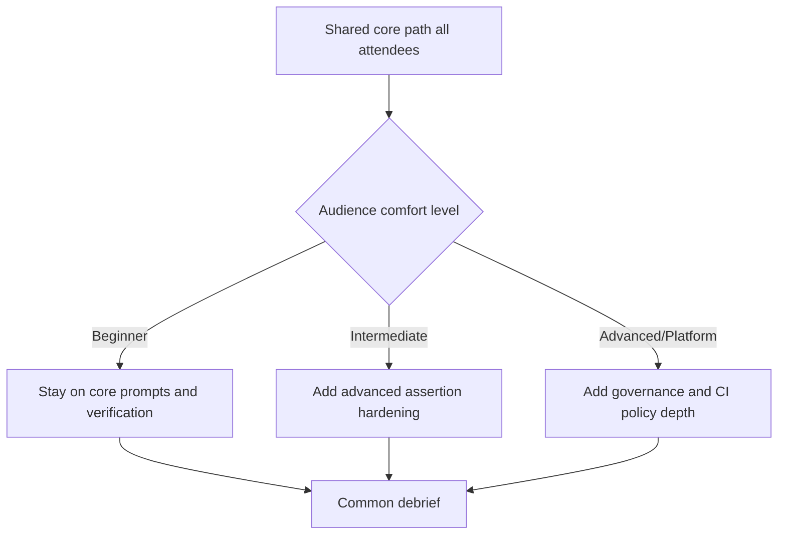
